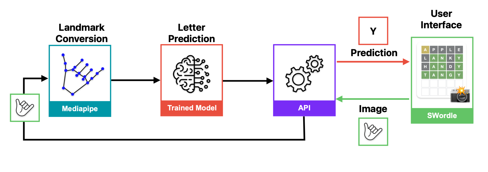

# The Creation of Swordle: Building a CNN Classifier with Mediapipe and Keras to identify American Sign Language Fingerspelling

## Introduction

As part of our final project for the 9 week Data Science bootcamp with Le Wagon, our team created a CNN classifier to identify different American Sign Language Fingerspelling letters packaged into a word game to allow the user to practice their signing in American Sign Languge. We chose American Sign Language as this was the language that we were able to find the most data for, but given more resources wand a longer time frame we would have liked to source more accurate Auslan data and expanded out approach to include words as well as individual letters.



The above flowchart shows the process that information follows to create the prediction:

1. Image capture from frontend camera
2. Frontend sends to web server via FastAPI
3. Web server applies Mediapipe coordinate transformation to image
4. Data is normalized and preprocessed
5. Pre-processed data is passed to model for prediction
6. Model predicts based on input data
7. Prediction sent from web-server back to frontend via FastAPI

Our product is packaged across two repos, sign-game-server and sign-game-UI.


---
# Instructions to Run

## 1. Clone both repos to local pc

```bash
gh repo clone cpsnowden/sign-game-server
gh repo clone cpsnowden/sign-game-UI
```
## 2. Start web-server in sign-game-server

With a terminal instance inside sign-game-server:
#### Create VENV

```bash
pyenv virtualenv sign-game-server
pyenv activate sign-game-server
pyenv local sign-game-server
```

#### Install Requirements

```bash
pip install -r requirements.txt
```

#### Start Local Fast API

```bash
make run
```
This starts the webserver locally.

## 3. Start the UI in sign-game-UI
#### Running Local API with New Keras Model

1. Update .env with the path to the new model
2. Run `make run`
3. Check that you model is picked up at http://localhost:8000/info
4. To switch production to the new model ensure you update `env.yaml`

## Converting images to landmark data - using scripts - Landmarks.py

1. Structure folder as per the following:

#### CD into sign-game-UI
```bash
cd ../sign-game-UI
```

#### Start local API

```bash
make run_local
```

#### Connect to localhost
- click on the link in your terminal or follow the URL presented
